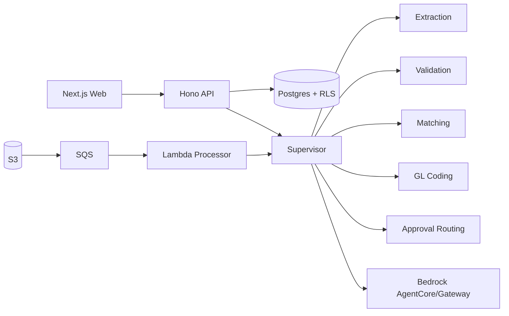

# Atlas AP ERP Long-Lived Implementation Session

This document records the build intent and operational map for the Atlas AP ERP module.

## Goal

Deliver an end-to-end invoice-to-pay module with:

- Multi-tenant data isolation through Postgres RLS.
- Agentic runtime orchestration through a Supervisor and specialist agents.
- Local deterministic execution for tests and demos.
- AWS-backed deployment seams for S3, SQS/EventBridge, Lambda, Bedrock AgentCore/Gateway, RDS, and IAM.
- A UI for AP clerks, approvers, exceptions, and ops observability.

## Architecture

## Local vs AWS Mode

- `AGENT_PROVIDER=local`: deterministic providers, no live AWS calls, used by tests.
- `AGENT_PROVIDER=bedrock`: Bedrock adapter invokes the configured supervisor agent and validates returned JSON.

## RLS Contract

Every tenant-scoped table has `tenant_id`, `ENABLE ROW LEVEL SECURITY`, and a `tenant_isolation` policy using `current_setting('app.tenant_id', true)::uuid`. API middleware derives the tenant from trusted auth headers in local/demo mode and the production auth integration should replace that with verified JWT claims.

## Acceptance Gates

- `bun test` passes.
- RLS migration contains policy and `ENABLE ROW LEVEL SECURITY` statements.
- Supervisor routes clean PO invoices to `queued_for_payment`.
- Low-confidence or variance invoices enter `exception`.
- Hono API exposes all planned public routes.
- CDK stack synthesizes or infra tests validate core resources.

