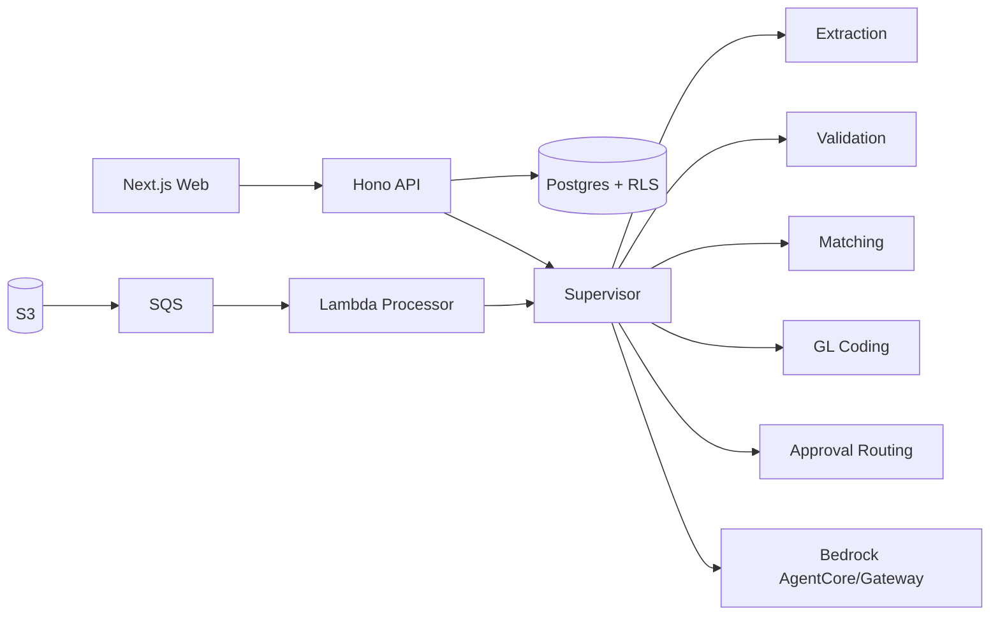

# Atlas AP ERP Implementation Session

This document records the build intent and operational map for the Atlas AP ERP platform.

## Goal

Deliver an end-to-end invoice-to-pay platform with:

- Multi-tenant data isolation through Postgres RLS.
- Agentic runtime orchestration through a Supervisor and specialist agents.
- Local deterministic execution for tests and local development.
- AWS-backed deployment seams for S3, SQS/EventBridge, Lambda, Bedrock AgentCore/Gateway, RDS, and IAM.
- A UI for AP clerks, approvers, control reviewers, and operations teams.

## Architecture

```mermaid
flowchart LR
  WEB[Next.js Web] --> API[Hono API]
  API --> DB[(Postgres + RLS)]
  API --> SUP[Supervisor]
  SUP --> EX[Extraction]
  SUP --> VA[Validation]
  SUP --> MA[Matching]
  SUP --> GL[GL Coding]
  SUP --> RO[Approval Routing]
  S3[(S3)] --> SQS[SQS]
  SQS --> L[Lambda Processor]
  L --> SUP
  SUP --> BR[Bedrock AgentCore/Gateway]
```

## Local vs AWS mode

- `AGENT_PROVIDER=local`: deterministic providers with no live AWS calls; used by tests and local development.
- `AGENT_PROVIDER=bedrock`: Bedrock adapter invokes the configured supervisor agent and validates returned JSON.

## RLS contract

Every tenant-scoped table has `tenant_id`, `ENABLE ROW LEVEL SECURITY`, and a `tenant_isolation` policy using
`current_setting('app.tenant_id', true)::uuid`. API middleware derives the tenant from trusted headers during
local development; production authentication must replace those headers with verified JWT claims.

## Acceptance gates

- `bun test` passes.
- RLS migration contains policy and `ENABLE ROW LEVEL SECURITY` statements.
- Supervisor routes clean PO invoices to `queued_for_payment`.
- Low-confidence or variance invoices enter `exception`.
- Hono API exposes all planned public routes.
- CDK stack synthesizes or infrastructure tests validate core resources.
