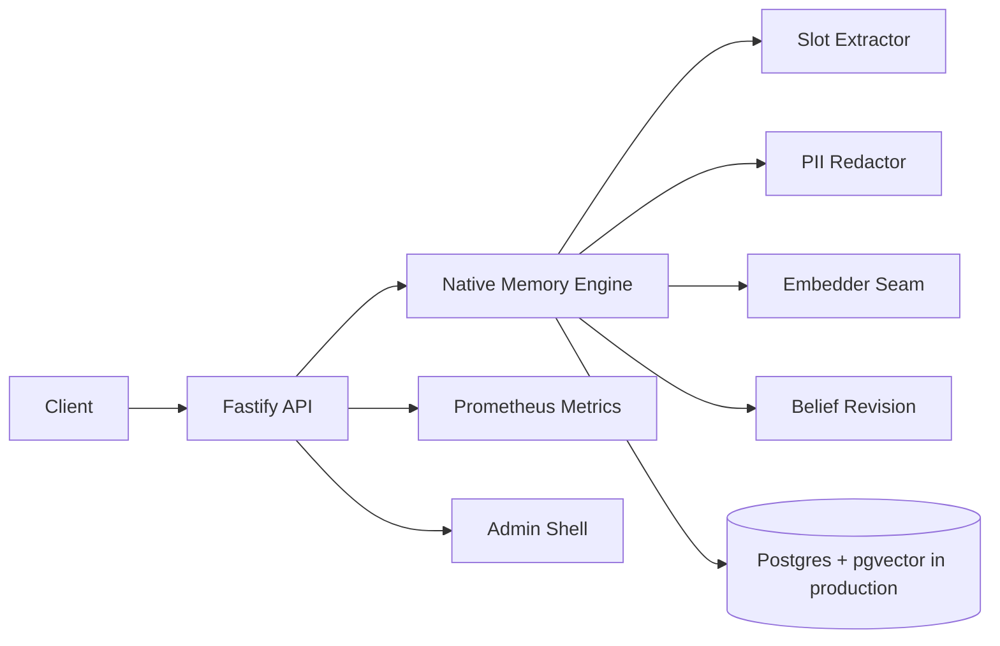

# Support Agent V2 Long-Lived Enterprise Session

Support Agent V2 is a native memory and belief-revision module added as a sibling workspace to Atlas AP.

## Current Milestone

P0 native core:

- Fastify API in `apps/support-agent`.
- Native in-process memory engine in `packages/memory-engine`.
- Shared Zod contracts in `packages/support-contracts`.
- pgvector/RLS schema and migration in `packages/support-db`.
- Deterministic extraction, regex PII redaction, deterministic embedder seam, belief revision, retrieval, episodes, artifacts, and stateless mode.
- 13-capability contract tests as the acceptance gate.

## Runtime Shape

## Invariants

- Stateless chat never reads or writes memory.
- Duplicate turns create no duplicate facts.
- A slot has at most one active fact per `(org, user)`.
- Replacements supersede prior facts and compute `replacedBy` in timelines.
- Facts are filtered by `org_id` and `user_id`; RLS migration enforces org isolation.

## Next Enterprise Hardening

- Swap local queue fallback for BullMQ + Redis.
- Add real Postgres store implementation behind `MemoryStore`.
- Add JWT/JWKS verification and hashed API-key issuance.
- Replace admin shell with Refine screens.
- Add OpenTelemetry/Sentry and k6 load tests.

