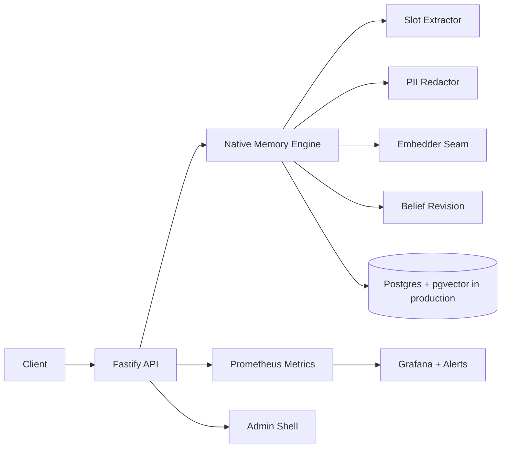

# Support Agent V2 Long-Lived Enterprise Session

Support Agent V2 is a native memory and belief-revision module added as a sibling workspace to Atlas AP.

## Current Milestone

P0 native core:

- Fastify API in `apps/support-agent`.
- Native in-process memory engine in `packages/memory-engine`.
- Shared Zod contracts in `packages/support-contracts`.
- pgvector/RLS schema and migration in `packages/support-db`.
- Deterministic extraction, regex PII redaction, deterministic embedder seam, belief revision, retrieval, episodes, artifacts, and stateless mode.
- 13-capability contract tests as the acceptance gate.
- Production adapters now include `PostgresNativeStore`, BullMQ queue/worker role, JWT/API-key auth paths, secure headers, per-tenant rate limiting, and structured logging.
- Operator workflows now include admin-only explorer, supersession graph data, PII review, audit log, DLQ replay, and API-key lifecycle routes.
- Release gates now include Apache-2.0 license/NOTICE, dependency license audit, CI workflow, Grafana dashboard, Prometheus alert rules, k6 load smoke, and observability scrubber/tracing seams.
- The spec is translated into `docs/support-agent-v2-feature-backlog.md`, which tracks FR/NFR status and the next PR stack.

## Runtime Shape

## Invariants

- Stateless chat never reads or writes memory.
- Duplicate turns create no duplicate facts.
- A slot has at most one active fact per `(org, user)`.
- Replacements supersede prior facts and compute `replacedBy` in timelines.
- Facts are filtered by `org_id` and `user_id`; RLS migration enforces org isolation.

## Next Enterprise Hardening

- Replace the static admin shell with a fuller Refine UI.
- Run live Postgres RLS and Redis BullMQ integration suites in CI service containers.
- Add JWKS provider discovery and external IdP role mapping.
- Convert the dependency-free tracing seam to full OpenTelemetry export when the deployment target is selected.
